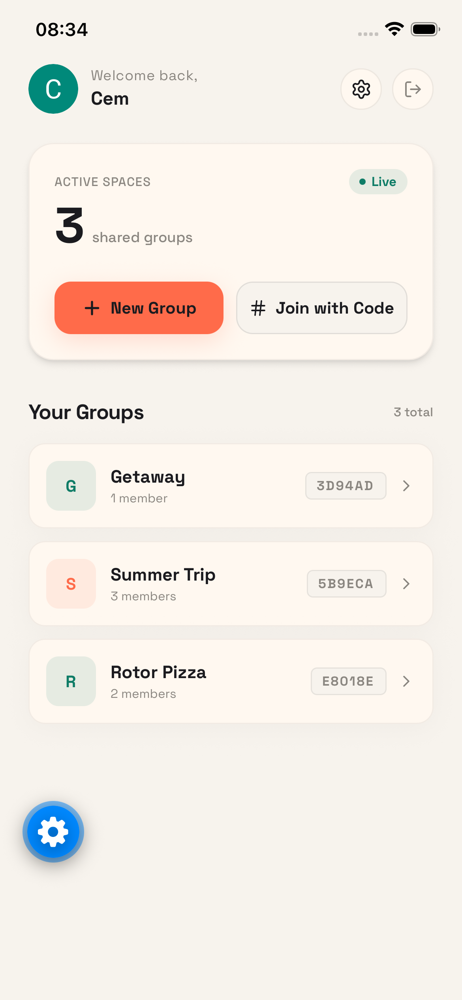
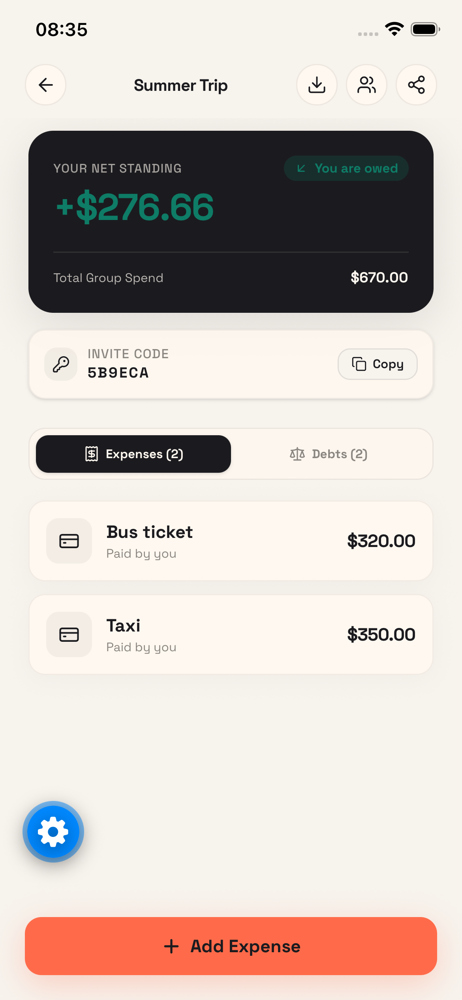
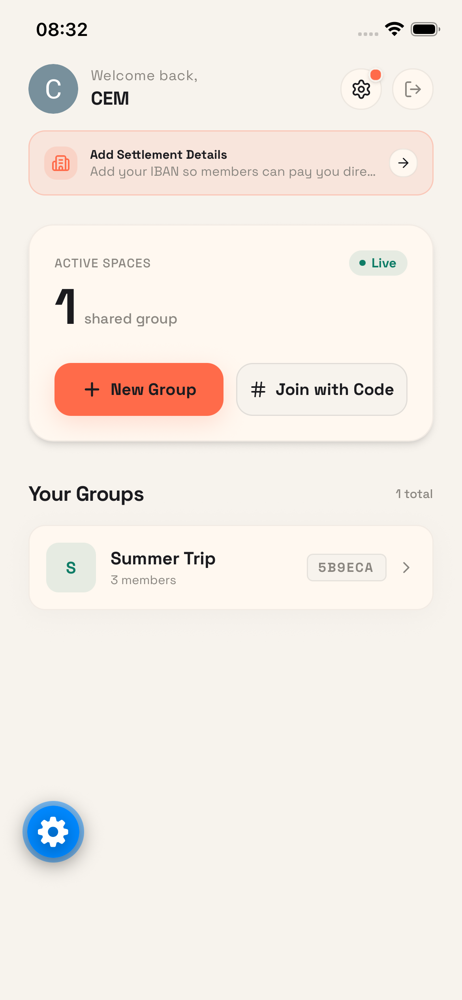
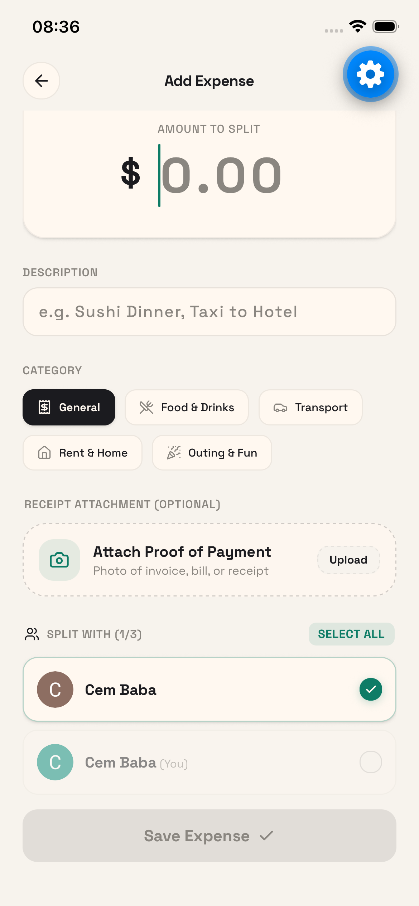
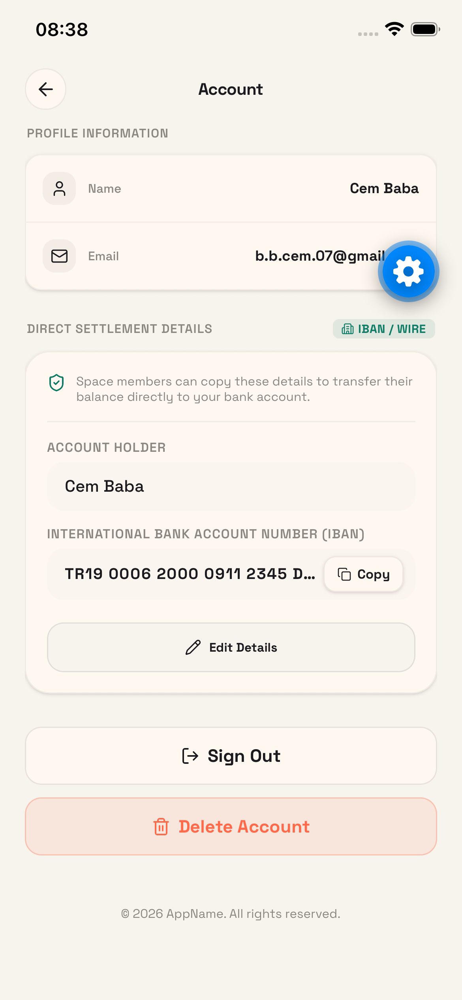
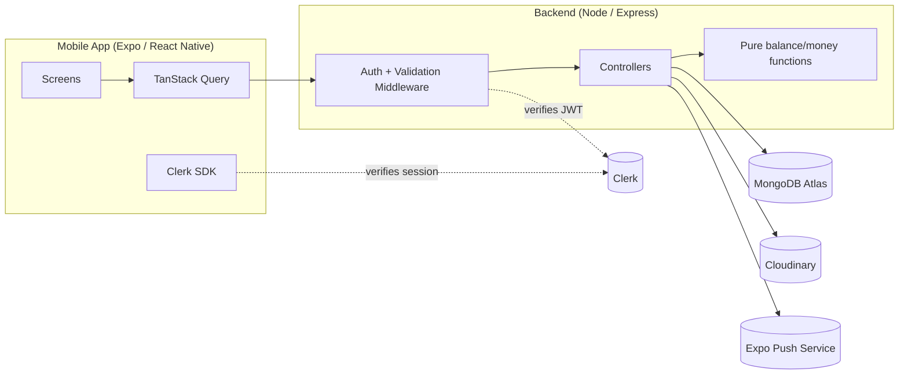

# Splitwise Clone

A full-stack expense-splitting app (backend + React Native mobile client) built to
practice production-grade patterns: authentication, correct money handling,
automated testing, and a clean API surface.

> **Live backend:** https://splitwise-clone-p9yp.onrender.com
> **CI:** 

---

## Screenshots


<p align="center">
  
  
  
  
  
</p>


---

## Features

- **Groups** — create a shared space, invite others via a short code, track members
- **Expenses** — log an expense, split it evenly among selected members
- **Balances** — see who owes whom, simplified into the minimum number of transactions
- **Settle Up** — record a real payment between two members, validated against actual balances
- **Direct settlement details** — save an IBAN so others can pay you directly, with a copy-to-clipboard flow
- **Receipts** — attach a photo of a receipt to an expense (stored in Cloudinary, not the database)
- **Push notifications** — get notified when an expense is added or a debt is settled
- **CSV export** — download a group's full expense and balance report

---

## Architecture



**Request flow:** the mobile app attaches a Clerk session token to every request.
The backend verifies that token (never trusts an ID sent in the body), checks
group membership for group-scoped routes, then runs the request through
validation (zod) before it reaches a controller. All balance and settlement math
lives in small, pure functions (`utils/money.js`, `utils/balances.js`) that are
unit-tested independently of the database.

---

## Tech Stack

**Backend**
- Node.js, Express
- MongoDB + Mongoose
- Clerk (authentication)
- Cloudinary (receipt image storage)
- Zod (request validation)
- Vitest + Supertest + mongodb-memory-server (testing)

**Mobile**
- Expo / React Native, TypeScript
- Expo Router
- Clerk (auth)
- TanStack Query (server state, caching, invalidation)
- NativeWind (Tailwind for React Native)

---

## Getting Started

### Prerequisites

- Node.js 20+
- A MongoDB connection string (Atlas or local)
- A Clerk application (publishable + secret key)
- A Cloudinary account (cloud name, API key, API secret)

### Backend

```bash
cd backend
npm install
cp .env.example .env   # fill in the values below
npm run dev
```

`.env`:
```
PORT=3000
MONGODB_URI=
CLERK_SECRET_KEY=
CLERK_PUBLISHABLE_KEY=
CLOUDINARY_CLOUD_NAME=
CLOUDINARY_API_KEY=
CLOUDINARY_API_SECRET=
```

Run the test suite:
```bash
npm test
```

### Mobile

```bash
cd mobile
npm install --legacy-peer-deps
cp .env.example .env   # fill in the values below
npx expo start
```

`.env`:
```
EXPO_PUBLIC_API_URL=http://localhost:3000/api
EXPO_PUBLIC_CLERK_PUBLISHABLE_KEY=
```

> On a physical device, `localhost` won't resolve to your machine — use your
> computer's LAN IP instead (e.g. `http://192.168.1.23:3000/api`).

Typecheck:
```bash
npx tsc --noEmit
```

---

## Design Decisions & Known Limitations

A few choices worth explaining, and a few gaps left open on purpose:

- **Money is stored as integer cents, never floats.** Splitting $100 three ways
  as `100 / 3` loses a cent to floating-point/rounding error. All amounts are
  converted to cents at the API boundary and split using the largest-remainder
  method, so split parts always sum back exactly to the original amount.
- **Settlements are a ledger, not a flag.** Early on, "settled" was a boolean on
  each expense split. That made it possible for the simplified debt shown to a
  user and the amount actually marked as paid to disagree. Settlements are now
  their own collection (`groupId`, `from`, `to`, `amountCents`, `timestamp`),
  and balance calculation always derives from expenses + settlements together.
- **Identity never comes from the client.** Every request's identity comes from
  a verified Clerk session token, not from an ID in the request body — an
  earlier version trusted a `clerkId` field sent by the client, which meant
  anyone who guessed another user's ID could act as them.
- **Receipts live in Cloudinary, not MongoDB.** Storing base64 images directly
  on the expense document meant every request to list a group's expenses also
  downloaded every receipt image. Receipts are now uploaded to Cloudinary on
  create/update, and the list endpoint omits the URL entirely (only the detail
  endpoint returns it).
- **Known limitation:** deleting an account while still a member of a
  non-empty group can leave orphaned settlement references. A production
  version would require settling all balances and leaving every group first.
- **Known limitation:** no pagination UI in the mobile app yet, even though the
  backend supports `?page=&limit=` on group and expense lists.
- **Known limitation:** the `create`/`edit` expense screens share most of their
  UI but aren't yet extracted into a shared form component.

---

## Testing

The backend has two layers of automated tests:

- **Unit tests** for the money/balance logic (`splitEvenly`,
  `computeGroupBalances`, `simplifyDebts`) — pure functions, no database.
- **Integration tests** (Supertest + an in-memory MongoDB) covering auth
  enforcement (401/403 paths) and the full expense → summary → settle-up flow.

```bash
cd backend
npm test
```

---

## Project Structure

```
backend/
  src/
    controllers/     # request handlers
    routes/           # Express routers
    middleware/       # auth, validation, error handling
    db/models/         # Mongoose schemas
    utils/             # pure functions: money, balances, receipt storage
  tests/               # integration tests
mobile/
  src/
    app/               # Expo Router screens
    components/        # UI components
    hooks/             # TanStack Query hooks
    services/          # API client functions
    context/           # React context (current user, alerts)
```

---

## License

Personal/portfolio project. No license specified.
